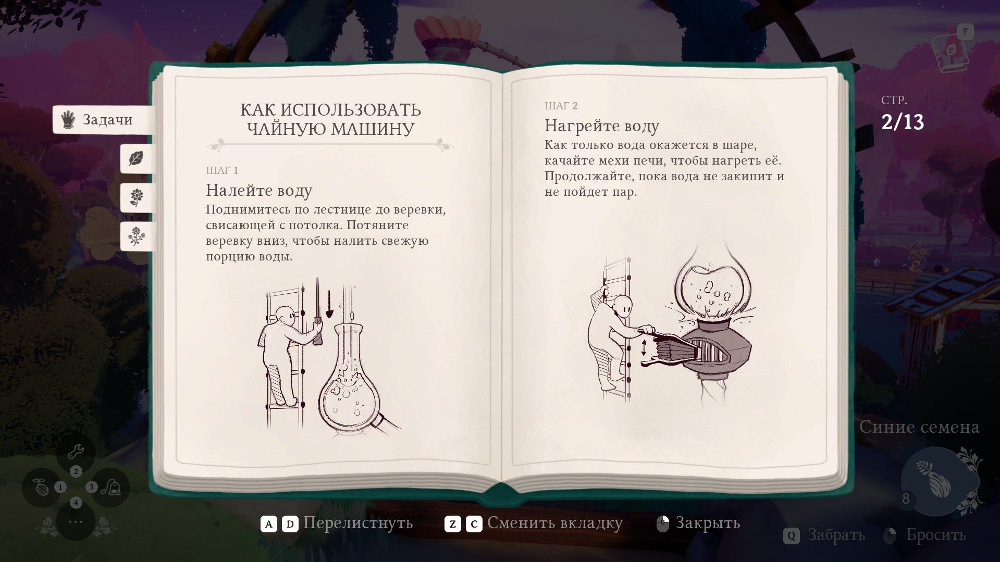
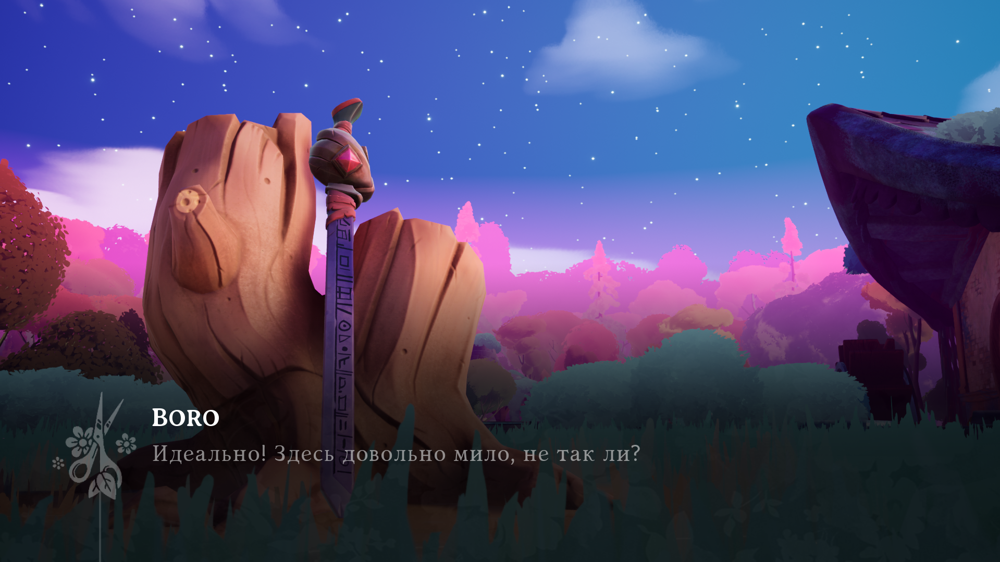

# Wanderstop-RU

## Описание

Перевод интерфейса, диалогов и всего остального в игре Wanderstop. Подобраны шрифты. Любителям сюжета и хороших переводов рекомендую подождать версию 1.1, когда будет закончена редактура текста.

## Ссылки на скачивание

- [Скачать с Яндекс Диск](https://disk.yandex.ru/d/4GvPyBNJ2LMPUg)
- [Скачать с GitHub](https://github.com/Dontaz/Wanderstop-RU/releases/latest)

## Инструкция по установке

- Скачать файл .exe по любой из ссылок в секции «Ссылка на скачивание [версия ***]»;
- Запустить .exe файл;
- Нажмите «Далее» снизу окна установщика;
- Проверьте, верный ли указан путь к вашей игре. Если путь неверен – укажите правильный путь к вашей игре;
- Когда вы убедились, что путь к вашей игре верен – нажмите «Далее» внизу окна установщика;
- Нажмите кнопку «Установить» внизу окна установщика;
- Установка завершена, нажмите «Завершить» внизу окна установщика.

## Пример перевода

